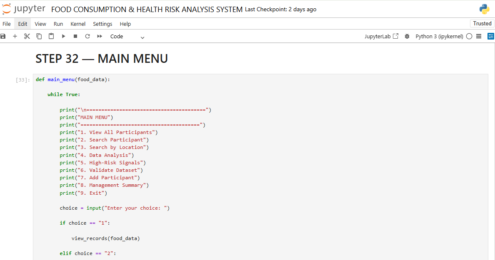

# Food-Consumption-and-Health-Risk-Analysis-System
The Food Consumption and Health Risk Analysis System is a Python-based project designed to analyze food-consumption patterns and identify potential dietary risk signals from simulated participant data.

## About the Project

The system organizes food-consumption records, validates the data, calculates dietary indicators, assigns risk scores, and classifies participants based on predefined risk criteria. It also provides features for searching participants and locations, analyzing risk factors, ranking risk scores, and generating an overall summary.

## Project Overview

The system uses participant food-consumption records to calculate indicators, assign risk scores, classify risk levels, and provide simple analysis of the dataset.

## Project Objectives

The system was designed to:

- Store and organize food-consumption records.
- Validate participant information.
- Calculate food-consumption indicators.
- Identify potential dietary risk signals.
- Classify records based on defined risk scores.
- Search for participants and locations.
- Compare risk patterns across locations.
- Identify common risk factors.
- Generate an overall summary of the dataset.

## Python Concepts Used

This project demonstrates the use of:

- Variables and data types
- Lists and dictionaries
- if, elif, and else statements
- for and while loops
- Functions
- User input
- Arithmetic, comparison and logical operators
- Data validation
- Error handling
- Searching and filtering
- Basic data analysis

## Risk Scoring

The system uses project-defined rules to identify potential dietary risk signals.

Risk factors include:

- Low food diversity
- High processed-food consumption
- High sugary-drink consumption
- Low fruit and vegetable consumption
- High fried-food consumption

The system then assigns a risk score and classifies each record as:

- Low Risk Signal
- Moderate Risk Signal
- Higher Risk Signal

## Key Features
1. Data Validation

 Checks participant records for issues such as missing information, invalid values, duplicate IDs and incorrect age groups.

2. Risk Analysis

 Calculates risk scores based on the defined dietary indicators.

3. Participant Search

 Allows the user to search for an individual participant using their ID.

4. Location Search

 Allows records to be searched by location.

5. Risk Ranking

 Identifies participants with higher risk signals based on their calculated scores.

6. Risk Factor Analysis

 Examines how frequently different dietary risk factors occur within the dataset.

7. Interactive Menu

 Provides a simple menu that allows users to interact with the different functions of the system.

## Technologies Used

**Python**

**Jupyter Notebook**

**Note:** This project uses simulated data for educational purposes. The results are not medical diagnoses or clinical recommendations.

### Author
Arabor Okojie

**Linked:** https://www.linkedin.com/in/arabor-okojie-9b4144376
